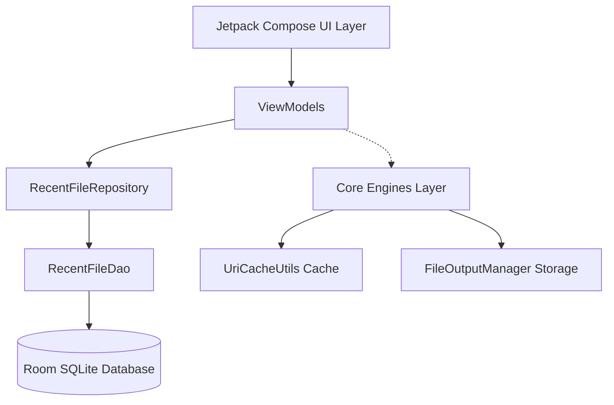
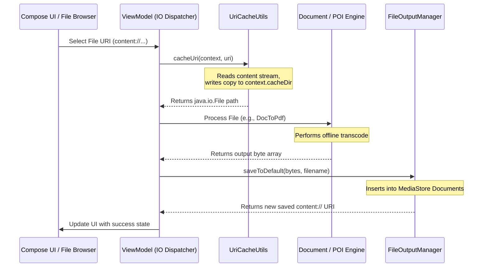

# OmniSuite — Architectural Deep-Dive

OmniSuite is designed around clean architecture principles and a strict **100% offline-first** execution model. It segregates logic into distinct layers to isolate complex Java-based file parsing engines (Apache POI/PDFBox) from Jetpack Compose UI rendering layers.

---

## Project Statistics (2026-09-01)

| Metric | Count |
|--------|-------|
| Total Kotlin Source Files | 140 |
| Registered Navigation Routes | 76 |
| Composable Destinations | 87 |
| Total Tools | 86 |
| ViewModels | 20 |
| Core Engines | 10 |
| Dependencies | 35 |
| Packages/Directories | 27 |

---

## 🏗️ Layered Architecture Overview

The app follows a unidirectional data flow conforming to MVVM (Model-View-ViewModel):



### 1. The Core Layer (`com.karnadigital.omnisuite.core`)
The engine room of the application, containing zero UI dependencies.
- **`core/engine/`**: Wrappers and configurations for heavy processing engines:
  - **Word/Excel/Slides converter engines** utilizing Apache POI.
  - **PDF operations engine** built on top of the PDFBox Android port.
  - **Barcode and QR code builders** using ZXing.
  - **Syntax highlighter** for 30+ programming languages.
  - **Encoding detector** with BOM detection and heuristics.
  - **PDF layout parser** for block-by-block editing.
- **`core/repository/` & `core/model/`**: Local Room database caching file operations and view histories.
- **`core/util/`**: Low-level platform helpers for sandboxing, zoom capabilities, and theme preferences.

### 2. The Dependency Injection Layer (`com.karnadigital.omnisuite.di`)
Bootstrapped via Dagger Hilt:
- **`DatabaseModule.kt`** binds singletons for `OmniDatabase`, `RecentFileDao`, and `RecentFileRepository`.
- **`CoreEntryPoint.kt`** provides access to core utilities from non-Hilt contexts.

### 3. The Feature Layer (`com.karnadigital.omnisuite.feature`)
Coordinated MVVM sub-packages separated by application modules:
- Each sub-package typically contains a Compose screen file (`*Screen.kt`) and its associated lifecycle coordinator (`*ViewModel.kt`).

### 4. Shared UI System (`com.karnadigital.omnisuite.ui`)
Contains global style configurations and reusable design blocks:
- **`ui/theme/`**: Theme tokens, typography, and AccentGlow colors.
- **`ui/component/`**: Toolkit layouts, card systems, top app bars, switches, and common states.
- **`ui/navigation/`**: Central NavGraph routing configurations.

---

## 🔒 The Storage Access Framework (SAF) Sandboxing Cache Pattern

Since Android 11, apps run inside sandboxed Scoped Storage. This creates a friction point:
- Heavyweight document engines like **Apache POI** and **PDFBox** require literal `java.io.File` paths or standard `FileInputStream` instances to seek and write files correctly.
- Android system intents and file pickers return virtual `content://` URIs via the Storage Access Framework (SAF).

OmniSuite bypasses this restriction securely using a **Temp Cache Sandboxing Flow**:



### Sandbox Utilities
- **`UriCacheUtils.kt`**: Safely streams bytes from the SAF Content Resolver and dumps them into a temporary file in `context.cacheDir`.
- **`FileOutputManager.kt`**: Uses MediaStore to insert the finalized output into `Documents/OmniSuite/<subfolder>` and returns the target `Uri`.

---

## ⚡ Threading & State Flow Architecture

All document parsing and file compression workloads are heavy on CPU and memory. OmniSuite uses strict coroutine boundaries to maintain a 60 FPS UI:

1. **ViewModels** expose state reactively using `StateFlow` (e.g., `PdfLoadState`, `ZipMakerState`).
2. **Dispatchers.IO** is explicitly invoked for all heavy I/O operations:
   ```kotlin
   suspend fun processFile(uri: Uri) = withContext(Dispatchers.IO) {
       val cachedFile = UriCacheUtils.cacheUri(context, uri)
       // perform POI or PDFBox work here
   }
   ```
3. **WeakReferences** and aggressive garbage collection triggers (`bitmap.recycle()`) are run inside views to keep memory within low-RAM device constraints.

---

## 📦 Package Structure

```
com/karnadigital/omnisuite/
├── core/
│   ├── engine/
│   │   ├── document/     (OfficeConverter, ReverseOfficeConverter)
│   │   ├── image/        (ImageLabExtensions, ImageUtils)
│   │   ├── pdf/          (empty)
│   │   └── utility/      (QrCodeGenerator, UtilityToolsRepository)
│   ├── model/            (RecentFile)
│   ├── repository/       (OmniDatabase, RecentFileDao, RecentFileRepository, ThemeRepository)
│   └── util/             (FileOutputManager, UriCacheUtils, ZoomableBox, etc.)
├── di/                   (CoreEntryPoint, DatabaseModule)
├── feature/
│   ├── history/          (HistoryScreen, HistoryViewModel)
│   ├── home/             (HomeScreen, FileBrowserScreen, FilesScreen, NavigationEvent)
│   ├── pdf_tools/        (46 files - PDF operations, conversions, block editor)
│   ├── settings/         (SettingsScreen, SettingsViewModel)
│   ├── tools/            (AllToolsScreen, ImageToolsScreen, ZipMakerScreen, etc.)
│   ├── utility/          (QR, OCR, Barcode, Scanner, Sticker, ReadAloud, etc.)
│   └── viewer/           (PDF, DOCX, XLSX, PPTX, TXT, Image, Archive viewers + EditMenu)
└── ui/
    ├── component/        (CommonStates, OmniBottomNav, ToolListRow, etc.)
    ├── navigation/       (OmniNavGraph, Screen)
    └── theme/            (Color, Theme, Type)
```

---

## 🔄 Reactive State Management

All ViewModels follow a sealed class pattern for state management:

```kotlin
sealed class PdfLoadState {
    object Loading : PdfLoadState()
    data class Success(val document: PDDocument, val pageCount: Int) : PdfLoadState()
    data class Error(val message: String) : PdfLoadState()
}
```

This pattern is consistent across all 20 ViewModels in the application.

---

## 🎯 Design Principles

1. **Offline-First**: Zero network dependencies for all core functionality.
2. **Single-Activity Architecture**: One `MainActivity` with Compose Navigation.
3. **Hilt Dependency Injection**: Compile-time verified dependency graph.
4. **Material 3 Design**: Dynamic color, edge-to-edge, adaptive layouts.
5. **Coroutines + Flow**: Reactive UI updates with structured concurrency.
6. **SAF Compliance**: Proper Android 11+ storage access via cache sandboxing.
