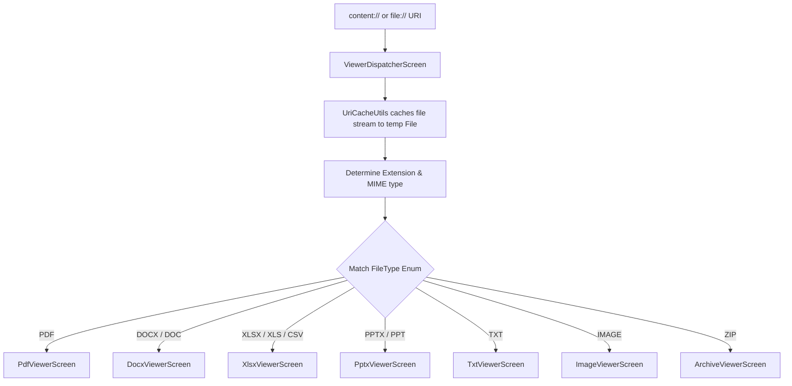

# OmniSuite — Navigation Reference & Route Graph

OmniSuite utilizes Jetpack Compose Navigation (`androidx.navigation:navigation-compose`) to govern viewport transactions. Routes are represented as a clean, type-safe sealed class hierarchy.

---

## 🚏 Sealed Route Registry (`Screen.kt`)

All route configurations inherit from `Screen(val route: String)` inside **[Screen.kt](file:///c:/Users/chait/Projects/Omnisuite/app/src/main/java/com/karnadigital/omnisuite/ui/navigation/Screen.kt)**:

| Object Name | Route String | Purpose | Arguments |
|---|---|---|---|
| `MainShell` | `main_shell` | Bottom navigation container (Workspace, Tools, Files, History) | None |
| `Tools` | `tools` | Full grid of categorized planning tools (inline or sub-page) | None |
| `Files` | `files` | Storage browser categories | None |
| `Settings` | `settings` | Application settings configurations | None |
| `QrGenerator` | `qr_generator` | WiFi, vCard, and SMS QR builder interface | None |
| `BarcodeScanner` | `barcode_scanner` | Live CameraX viewfinder barcode capture loop | None |
| `Ocr` | `ocr` | Image-to-text Vision engine OCR launcher | None |
| `SignaturePad` | `signature_pad` | Capture digital signature and stamp it to a PDF | None |
| `Watermark` | `watermark` | Text/image watermark settings panel | None |
| `BatchTools` | `batch_tools` | Batch operation dashboard | None |
| `ZipMaker` | `zip_maker` | Multiple file packaging interface | None |
| `ImagesToPdf` | `images_to_pdf` | Select image assets and compile to a paginated PDF | None |
| `ViewerDispatcher` | `viewer_dispatcher?fileUri={fileUri}` | Dynamic route that automatically determines the correct viewer screen based on MIME type | `fileUri` (SAF URL Encoded Query String, optional/nullable) |
| `PdfMerge` | `pdf_merge` | Select and merge multiple PDFs | None |
| `PdfSplit` | `pdf_split` | Split PDF by page ranges | None |
| `PdfLock` | `pdf_lock` | Encrypt/decrypt PDFs with passwords | None |
| `DocToPdf` | `doc_to_pdf` | DOCX-to-PDF transcoding tool | None |
| `PptToPdf` | `ppt_to_pdf` | PPTX-to-PDF transcoding tool | None |
| `ScanToPdf` | `scan_to_pdf` | Camera capture compiler to PDF | None |
| `PdfToImages` | `pdf_to_images` | Extract PDF pages to JPEG images | None |
| `PdfToWord` | `pdf_to_word` | PDF-to-Word extraction | None |
| `PdfToPpt` | `pdf_to_ppt` | PDF-to-PPTX extraction | None |
| `PdfToExcel` | `pdf_to_excel` | PDF-to-Excel extraction | None |
| `PdfFormFiller` | `pdf_form_filler` | Form filling coordinator | None |

---

## 🔀 Polymorphic Viewer Dispatcher (`ViewerDispatcherScreen.kt`)

Rather than exposing explicit screen routes for every individual document format, OmniSuite delegates file loading to the **[ViewerDispatcherScreen.kt](file:///c:/Users/chait/Projects/Omnisuite/app/src/main/java/com/karnadigital/omnisuite/feature/viewer/ViewerDispatcherScreen.kt)**.

When the application requests `Screen.ViewerDispatcher.createRoute(uri)`, the dispatcher resolves the file properties and renders the appropriate composable inline:



### MIME Type Resolution Rules
Extensions and MIME types are resolved on background contexts to categorize files into `enum class FileType`:

- **`FileType.PDF`**: `pdf`
- **`FileType.DOCX`**: `docx`, `doc`
- **`FileType.XLSX`**: `xlsx`, `xls`
- **`FileType.CSV`**: `csv` (rendered inside `XlsxViewerScreen`)
- **`FileType.PPTX`**: `pptx`, `ppt`
- **`FileType.TXT`**: `txt`, `log`, `json`, `xml`, `html`
- **`FileType.IMAGE`**: `png`, `jpg`, `jpeg`, `webp`, `bmp`, `gif`
- **`FileType.ARCHIVE`**: `zip`

### Sandboxing Isolation
The dispatcher ensures that before invoking the viewer, `UriCacheUtils.cacheUri(context, uri)` completes, providing a secure local filepath reference:
```kotlin
// Inside ViewerDispatcherScreen.kt
val tempFile = withContext(Dispatchers.IO) {
    UriCacheUtils.cacheUri(context, uri)
}
```
This cached path is then passed directly as a string parameter to the selected viewer screen.

---

## 🧭 NavHost Configuration (`OmniNavGraph.kt`)

The navigation tree is configured in **[OmniNavGraph.kt](file:///c:/Users/chait/Projects/Omnisuite/app/src/main/java/com/karnadigital/omnisuite/ui/navigation/OmniNavGraph.kt)**:

- Binds Hilt-provided viewmodels (`hiltViewModel()`) to screen lifecycles.
- Decodes URL-encoded arguments safely:
  ```kotlin
  composable(
      route = Screen.ViewerDispatcher.route,
      arguments = listOf(navArgument("fileUri") { type = NavType.StringType; nullable = true })
  ) { backStackEntry ->
      val fileUri = backStackEntry.arguments?.getString("fileUri")?.let { Uri.decode(it) }
      ViewerDispatcherScreen(
          fileUriString = fileUri,
          onBack = { navController.popBackStack() }
      )
  }
  ```
- Ensures clean backstack pops. For example, when opening an external sharing intent, it navigates to the dispatcher and pops up to the `MainShell` to keep the backstack shallow.
