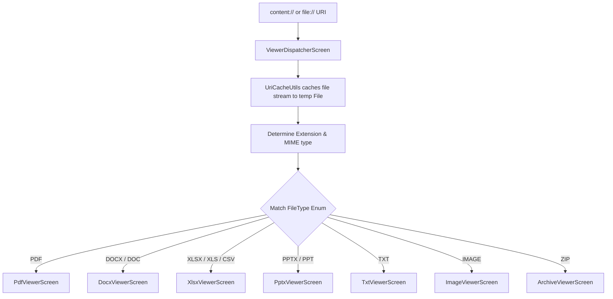

# OmniSuite — Navigation Reference & Route Graph

OmniSuite utilizes Jetpack Compose Navigation (`androidx.navigation:navigation-compose`) to govern viewport transactions. Routes are represented as a clean, type-safe sealed class hierarchy.

**Last Updated:** 2026-09-01
**Total Routes:** 76 route objects in Screen.kt
**Registered Destinations:** 87 composable destinations in OmniNavGraph.kt

---

## 🚏 Sealed Route Registry (`Screen.kt`)

All route configurations inherit from `Screen(val route: String)` inside **`Screen.kt`**:

### Core Navigation

| Object Name | Route String | Purpose | Arguments |
|---|---|---|---|
| `MainShell` | `main_shell` | Bottom navigation container (Workspace, Tools, Files, History) | None |
| `Tools` | `tools` | Full grid of categorized planning tools (inline screen) | None |
| `Files` | `files` | Storage browser categories (inline screen) | None |
| `Settings` | `settings` | Application settings configurations | None |
| `History` | `history` | History log screen | None |

### Viewer & File Access

| Object Name | Route String | Purpose | Arguments |
|---|---|---|---|
| `ViewerDispatcher` | `viewer_dispatcher?fileUri={fileUri}` | Dynamic route that auto-determines correct viewer | `fileUri` (optional) |
| `SequentialImageViewer` | `sequential_image_viewer?uris={uris}&title={title}` | Multi-image sequential viewer | `uris`, `title` |

### PDF Tools (56 routes)

| Object Name | Route String | Purpose |
|---|---|---|
| `PdfMerge` | `pdf_merge` | Merge multiple PDFs |
| `PdfSplit` | `pdf_split` | Split PDF by page ranges |
| `PdfLock` | `pdf_lock` | Encrypt PDF with password |
| `PdfDecrypt` | `pdf_decrypt` | Decrypt password-protected PDF |
| `PdfRotate` | `pdf_rotate` | Rotate PDF pages |
| `PdfExtract` | `pdf_extract` | Extract specific pages |
| `PdfDelete` | `pdf_delete` | Delete specific pages |
| `PdfCompress` | `pdf_compress` | Reduce PDF file size |
| `PdfFlatten` | `pdf_flatten` | Flatten form fields |
| `PdfPageNumber` | `pdf_page_number` | Add page numbers |
| `PdfReorder` | `pdf_reorder` | Drag-and-drop page reorder |
| `PdfExtractImages` | `pdf_extract_images` | Extract embedded images |
| `PdfFormFiller` | `pdf_form_filler` | Fill PDF forms |
| `PdfHeaderFooter` | `pdf_header_footer` | Add header/footer |
| `PdfResize` | `pdf_resize` | Change page size |
| `PdfToPdfA` | `pdf_to_pdfa` | Convert to PDF/A |
| `PdfMetadata` | `pdf_metadata` | Edit metadata |
| `PdfCropMargins` | `pdf_crop_margins` | Crop page margins |
| `PdfRedact` | `pdf_redact` | Redact content |
| `PdfRepair` | `pdf_repair` | Repair corrupted PDF |
| `PdfOverlay` | `pdf_overlay` | Overlay PDF on PDF |
| `PdfCompare` | `pdf_compare` | Compare two PDFs |
| `PdfToMarkdown` | `pdf_to_markdown` | Convert to Markdown |
| `PdfSplitBySize` | `pdf_split_by_size` | Split by file size |
| `PdfInsertPages` | `pdf_insert_pages` | Insert pages from another PDF |
| `PdfReplacePages` | `pdf_replace_pages` | Replace pages |
| `PdfBookmarks` | `pdf_bookmarks` | Edit bookmarks |
| `PdfSplitByBookmarks` | `pdf_split_by_bookmarks` | Split at bookmark boundaries |
| `PdfUnderlay` | `pdf_underlay` | PDF underlay |
| `PdfFormCreation` | `pdf_form_creation` | Create fillable forms |
| `PdfSelectiveImageExtract` | `pdf_selective_image_extract` | Selective image extraction |
| `PdfAllPagesToImage` | `pdf_all_pages_to_image` | Render all pages as images |
| `PdfBookmarkReader` | `pdf_bookmark_reader` | Read bookmarks |
| `PdfAValidation` | `pdf_a_validation` | PDF/A validation |
| `PdfToWordEnhanced` | `pdf_to_word_enhanced` | Enhanced PDF-to-Word |
| `MarkdownToPdfEnhanced` | `markdown_to_pdf_enhanced` | Enhanced Markdown-to-PDF |
| `AdvancedWordCount` | `advanced_word_count` | Advanced word count |
| `PdfBlockEditor` | `pdf_block_editor` | Block-by-block editor (experimental) |

### Conversions (12 routes)

| Object Name | Route String | Purpose |
|---|---|---|
| `DocToPdf` | `doc_to_pdf` | Word-to-PDF |
| `PptToPdf` | `ppt_to_pdf` | Slides-to-PDF |
| `XlsToPdf` | `xls_to_pdf` | Excel-to-PDF |
| `ScanToPdf` | `scan_to_pdf` | Camera-to-PDF |
| `WebToPdf` | `web_to_pdf` | Web-to-PDF |
| `HtmlToPdf` | `html_to_pdf` | HTML-to-PDF |
| `MarkdownToPdf` | `markdown_to_pdf` | Markdown-to-PDF |
| `TxtToPdf` | `txt_to_pdf` | Text-to-PDF |
| `CsvToPdf` | `csv_to_pdf` | CSV-to-PDF |
| `ImagesToPdf` | `images_to_pdf` | Images-to-PDF |
| `ImagesToPdfLayout` | `images_to_pdf_layout` | Images-to-PDF with layout |
| `SvgToPdf` | `svg_to_pdf` | SVG-to-PDF |

### Reverse Conversions (6 routes)

| Object Name | Route String | Purpose |
|---|---|---|
| `PdfToImages` | `pdf_to_images` | PDF-to-Images |
| `PdfToWord` | `pdf_to_word` | PDF-to-Word |
| `PdfToPpt` | `pdf_to_ppt` | PDF-to-PowerPoint |
| `PdfToExcel` | `pdf_to_excel` | PDF-to-Excel |
| `PdfToTxt` | `pdf_to_txt` | PDF-to-Text |

### Office Conversions (5 routes)

| Object Name | Route String | Purpose |
|---|---|---|
| `DocxToTxt` | `docx_to_txt` | Word-to-Text |
| `CsvToXlsx` | `csv_to_xlsx` | CSV-to-Excel |
| `XlsxToCsv` | `xlsx_to_csv` | Excel-to-CSV |
| `PptxToTxt` | `pptx_to_txt` | PowerPoint-to-Text |

### Utility Tools (22 routes)

| Object Name | Route String | Purpose |
|---|---|---|
| `QrGenerator` | `qr_generator` | QR code builder |
| `BarcodeScanner` | `barcode_scanner` | Barcode scanner |
| `Ocr` | `ocr` | Text recognition |
| `SignaturePad` | `signature_pad` | Digital signature |
| `Watermark` | `watermark` | Watermark PDF |
| `BatchTools` | `batch_tools` | Batch operations |
| `ZipMaker` | `zip_maker` | ZIP creator |
| `TarTools` | `tar_tools` | TAR archiver |
| `PasswordZip` | `password_zip` | Password-protected ZIP |
| `PasswordZipExtract` | `password_zip_extract` | Extract password ZIP |
| `FileEncrypt` | `file_encrypt` | AES-256 file encryption |
| `FileDecrypt` | `file_decrypt` | AES-256 file decryption |
| `FileChecksum` | `file_checksum` | MD5/SHA-256 hash |
| `UnitConverter` | `unit_converter` | Unit conversion |
| `ColorPicker` | `color_picker` | Color picker |
| `CollageMaker` | `collageMaker` | Photo collage |
| `MemeMaker` | `meme_maker` | Meme maker |
| `StickerMaker` | `sticker_maker` | Sticker extraction |
| `StickerImport` | `sticker_import` | Sticker import |
| `ExactResize` | `exact_resize` | Exact dimension resize |
| `TextCompare` | `text_compare` | Text comparison |
| `ReadAloud` | `read_aloud` | Text-to-speech |

### Image Tools (1 route)

| Object Name | Route String | Purpose |
|---|---|---|
| `ImageTools` | `image_tools` | Image editing tools |

---

## 🔀 Polymorphic Viewer Dispatcher (`ViewerDispatcherScreen.kt`)

Rather than exposing explicit screen routes for every individual document format, OmniSuite delegates file loading to **`ViewerDispatcherScreen.kt`**.

When the application requests `Screen.ViewerDispatcher.createRoute(uri)`, the dispatcher resolves the file properties and renders the appropriate composable inline:



### MIME Type Resolution Rules
Extensions and MIME types are resolved on background contexts to categorize files into `enum class FileType`:

- **`FileType.PDF`**: `pdf`
- **`FileType.DOCX`**: `docx`, `doc`
- **`FileType.XLSX`**: `xlsx`, `xls`
- **`FileType.CSV`**: `csv` (rendered inside `XlsxViewerScreen`)
- **`FileType.PPTX`**: `pptx`, `ppt`
- **`FileType.TXT`**: `txt`, `log`, `json`, `xml`, `html`, `py`, `kt`, `java`, `css`, `js`, `md`, and 40+ more
- **`FileType.IMAGE`**: `png`, `jpg`, `jpeg`, `webp`, `bmp`, `gif`
- **`FileType.ARCHIVE`**: `zip`

### Sandboxing Isolation
The dispatcher ensures that before invoking the viewer, `UriCacheUtils.cacheUri(context, uri)` completes, providing a secure local filepath reference:
```kotlin
val tempFile = withContext(Dispatchers.IO) {
    UriCacheUtils.cacheUri(context, uri)
}
```
This cached path is then passed directly as a string parameter to the selected viewer screen.

---

## 🧭 NavHost Configuration (`OmniNavGraph.kt`)

The navigation tree is configured in **`OmniNavGraph.kt`**:

- Binds Hilt-provided viewmodels (`hiltViewModel()`) to screen lifecycles.
- Decodes URL-encoded arguments safely.
- Ensures clean backstack pops.

### Navigation Events
Navigation is driven by a sealed `NavigationEvent` class with 64 event types covering:
- Tool navigation (PDF tools, conversions, utilities)
- Viewer navigation (file opening)
- File operations (open, share, print)

### Key Navigation Patterns
1. **MainShell** is the root (contains Workspace dashboard + History bottom tabs)
2. **ViewerDispatcher** is a polymorphic router that resolves MIME types to the correct viewer
3. **Tools**, **Files**, and **PdfTools** are used as inline screens within HomeScreen
4. Navigation events are handled via `NavigationEvent` sealed class
